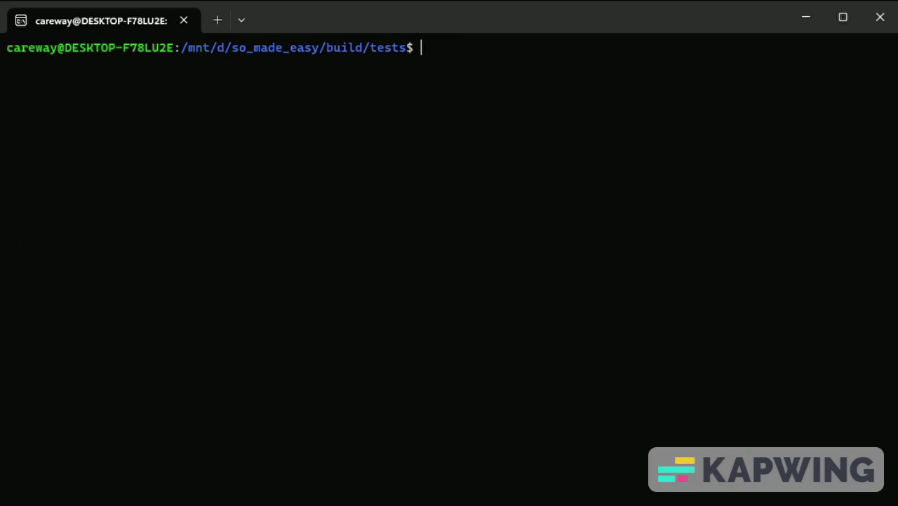

# Some 

This project purpose is making simpler to output real-time data, which sometimes can be really complex.

You can specify:
-  the id for the cmd output
-  or none, and it will take the line and the file of where the function was call.

